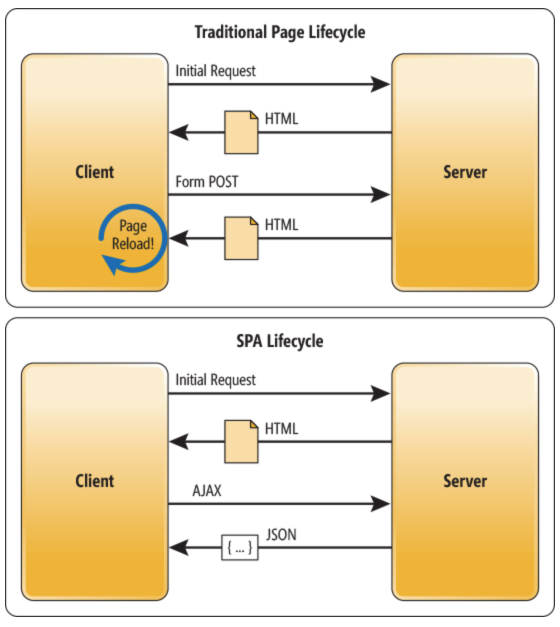
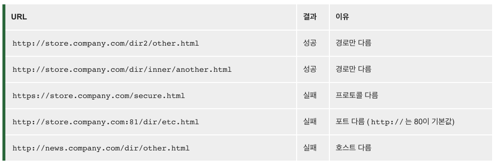

# REST API (Representational safe transfer)

## REST 구성
* 자원(Resource) - URI
* 행위(Verb) - HTTP METHOD 
* 표현(Representations) - MESSAGE


* 예) '이름이 Terry인 사용자를 생성한다' 라는 호출
    * 사용자 - 생성되는 리소스
    * 생성한다 - 메서드
    * 메시지 - 이름이 Terry인 사용자
    ```
    // REST 형태로 표현해보면
    
    HTTP POST, http://myweb/users/
    {  
       "users":{  
          "name":"terry"
       }
    }
    ```

### REST 메서드
* HTTP 메서드를 그대로 사용 (POST, GET, PUT, DELETE ..)

### HTTP 리소스
* REST 는 리소스 지향 아키텍쳐 스타일 → 모든 것을 리소스 즉 명사로 표현함.
```
// 사용자 생성
HTTP Post, http://myweb/users/
{  
   "name":"terry",
   "address":"seoul"
}

// 사용자 조회
HTTP Get, http://myweb/users/terry

// 사용자 수정
HTTP PUT Post, http://myweb/users/
{  
   "name":"terry",
   "address":"seoul"
}

// 사용자 삭제
HTTP DELETE, http://myweb/users/terry
```
## Reference
* [REST API의 이해와 설계-#1 개념 소개](https://bcho.tistory.com/953)

<hr>

# SPA(Single-Page Application) vs. MPA(Multi-Page Application)



## MPA - SSR(Server Side Rendering)
* 새로운 페이지를 요청할 때마다 정적 리소스가 다운로드 되고, 그에 맞춰 전체 페이지를 다시 렌더링한다.
* 인터넷 주소창에 주소를 입력하거나 링크를 클릭하는 등 사용자가 어떤 요청을 하면, 그에 맞는 html/이미지 등의 파일들이 전부 다운로드 되고 다시 렌더링 된다.

## SPA - CSR(Client Side Rendering)
* 웹 애플리케이션에 필요한 모든 정적 리소스를 최초 한번에 다운로드한다.
* 그 이후 새로운 페이지 요청이 있을 경우, 페이지 갱신에 필요한 데이터만 전달받아 페이지를 갱신한다.
* 어떤 링크를 클릭한다고 해서 그에 관련된 모든 파일을 다운받는게 아니라, 필요한 정보만 받아서 그 정보를 기준으로 업데이트 될 뿐이다.


## Reference
* [SPA vs. MPA](https://velog.io/@thms200/SPA-vs.-MPA)

<hr>

# Same-Origin Policy 와 CORS 에러
https://book.naver.com/bookdb/book_detail.nhn?bid=14619739
에서 아래 내용을 읽다가 궁금증이 생겨 CORS 에 대해 더 찾아보았다.

* Spring Security는 기본적으로 Same-Origin 정책을 사용한다. 
* → MSA 구조에서 다른 오리진에서 오는 요청을 허용하기 위해, 백엔드 서비스에서 CORS (Cross-Origin Resource Sharing)을 활성화 해야 한다.

## SOP (동일 출처 정책, Same-Origin Policy)

* 어떤 출처에서 불러온 문서나 스크립트가 다른 출처에서 가져온 리소스와 상호작용하는 것을 제한하는 중요한 보안 방식입니다. 
* 동일 출처 정책은 잠재적으로 해로울 수 있는 문서를 분리함으로써 공격받을 수 있는 경로를 줄여줍니다.
* 참고로, 출처를 비교하는 로직은 서버에 구현된 스펙이 아니라 브라우저에 구현되어 있는 스펙이다.

> 즉, 동일 출처 정책은 웹 브라우저 보안을 위해 프로토콜, 호스트, 포트가 동일한 서버로만(=같은 Origin  출처의 서버로만)  요청을 주고 받을 수 있도록 한 정책이다.

### 출처(Origin)란?
* 두 URL의 프로토콜, 포스트, 포트가 모두 같아야 동일한 출처라고 말합니다.


### 그렇다면 프로토콜, 호스트, 포트는 무엇인가?
* 개발자 도구 console에서 `location` 입력하면 브라우저 위치, 주소와 관련된 정보 확인이 가능합니다.

### 만약, 같은 Origin 출처의 서버로 요청을 보내지 않으면?
* 예를 들어 클라이언트를 3000포트, 서버를 8080포트에서 실행한 후에 클라이언트에서 서버로 AJAX요청을 보내면 어떻게 될까?<br>
→ 같은 도메인으로 요청을 보낸 것이 아니기 때문에, 동일 출처 정책에 의해 에러가 발생한다. 

```
XMLHttpRequest cannot load 'http://localhost:3000'. No 'Access-Control-Allow-Origin' header is present on the requested resource. Origin 'http://localhost:8080' is therefore not allowed access.
```

> 외부 API를 사용하기도 하고, 클라이언트와 서버를 분리하여 개발하는 경우도 많기 때문에<br>
> 이 문제를 해결하려면, 다른 오리진에서 오는 요청을 허용하기 위해, 백엔드 서비스에서 CORS(Cross-Origin Resource Sharing)를 활성화 해야 한다.

## CORS (Cross-Origin Resource Sharing)

* 추가 HTTP 헤더를 사용하여, 한 출처에서 실행 중인 웹 애플리케이션이 다른 출처의 선택한 자원에 접근할 수 있는 권한을 부여하도록 브라우저에 알려주는 체제입니다. 
* 웹 애플리케이션은 리소스가 자신의 출처(도메인, 프로토콜, 포트)와 다를 때 교차 출처 HTTP 요청을 실행합니다.

> * 즉, CORS는 브라우저의 구현 스펙에 포함되는 정책이기 때문에, 브라우저를 통하지 않고 서버 간 통신을 할 때는 이 정책이 적용되지 않는다. 
> * 또한, CORS 정책을 위반하는 리소스 요청 때문에 에러가 발생했다고 해도 서버 쪽 로그에는 정상적으로 응답을 했다는 로그만 남기 때문에, CORS가 돌아가는 방식을 정확히 모르면 에러 트레이싱에 난항을 겪을 수도 있다.

### spring boot에서 CORS 문제 해결하기

1. @Controller 나 @RequestMapping에 @CrossOrigin(origins = "http://localhost:8096") 을 추가
2. WebMvcConfigurer의 addCorsMappings 메소드 활용

```java
import org.springframework.beans.factory.annotation.Value;
import org.springframework.context.annotation.Bean;
import org.springframework.context.annotation.Configuration;
import org.springframework.util.StringUtils;
import org.springframework.web.servlet.config.annotation.CorsRegistration;
import org.springframework.web.servlet.config.annotation.CorsRegistry;
import org.springframework.web.servlet.config.annotation.WebMvcConfigurer;

@Configuration
public class HolaWebConfig {

	@Value("${hola.application.web.cors.origins:#{null}}")	// set null as the default value for a @Value in Spring
	private String origins;

	@Value("${hola.application.web.cors.credentials:#{null}}")
	private String credentials;

	@Value("${hola.application.web.cors.methods:#{null}}")
	private String methods;


	@Bean
	public WebMvcConfigurer holaCorsConfigurer() {

		log.debug(" > origins: {}", origins);
		log.debug(" > credentials: {}", credentials);
		log.debug(" > methods: {}", methods);

		WebMvcConfigurer configurer = new WebMvcConfigurer() {
			@Override
			public void addCorsMappings(CorsRegistry registry) {
				CorsRegistration corsRegistration = registry.addMapping("/**");

				if (origins != null) {
					log.debug(" > origins({}) is not null.", origins);
					corsRegistration.allowedOrigins(StringUtils.trimArrayElements(origins.split(",")));
				}

				if (credentials != null) {
					log.debug(" > credentials({}) is not null.", credentials);
					corsRegistration.allowCredentials(Boolean.valueOf(credentials));
				}

				if (methods != null) {
					log.debug(" > methods({}) is not null.", methods);
					corsRegistration.allowedMethods(StringUtils.trimArrayElements(methods.split(",")));
				}
			}
		};

		return configurer;
	}
}
```

```
15:33:22.457 [backoffice-partner,,,] DEBUG l.a.framework.config.HolaWebConfig -  > origins: http://localhost:8096
15:33:22.457 [backoffice-partner,,,] DEBUG l.a.framework.config.HolaWebConfig -  > credentials: true
15:33:22.457 [backoffice-partner,,,] DEBUG l.a.framework.config.HolaWebConfig -  > methods: GET, POST, DELETE, PATCH, PUT
```

## References
* https://velog.io/@yejinh/CORS-4tk536f0db
* https://evan-moon.github.io/2020/05/21/about-cors/
* https://developer.mozilla.org/ko/docs/Web/Security/Same-origin_policy
* https://developer.mozilla.org/ko/docs/Web/HTTP/CORS


