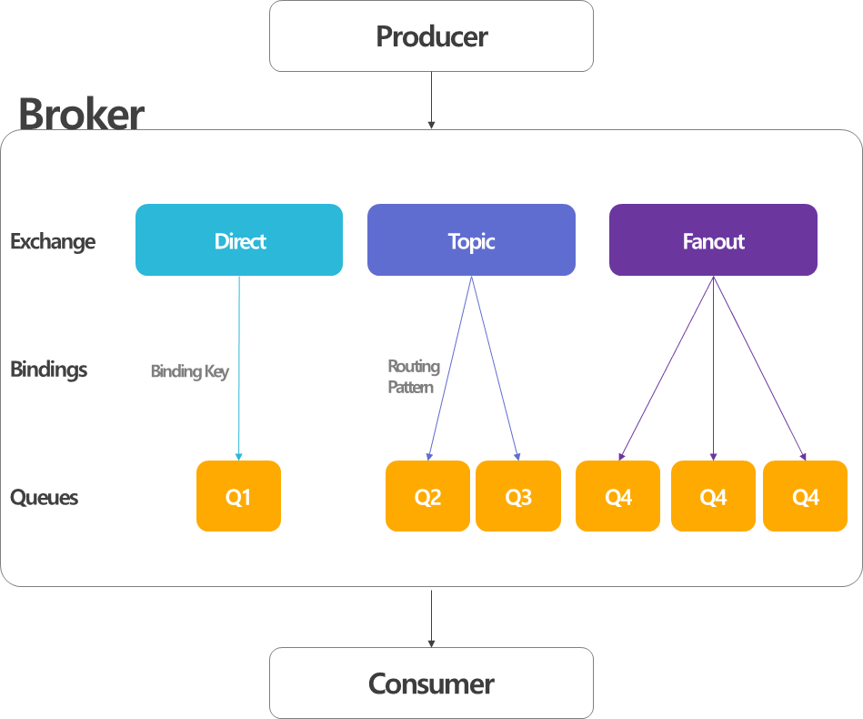

# Ch08

# ✳ 0. Message Queue

---

## Message Queue 란 무엇인가??

- 메시지 지향 미들웨어(Meesage Oriented Middleware: MOM)은 비동기 메시지를 사용하는 다른 응용 프로그램 사이에서 데이터 송수신을 의미
    - 메시지를 통해 여러 분산되어 있는 시스템 간의 Connector 역할로 결합성을 낮추고, 이들이 서로 실시간 비동기식 데이터를 교환할 수 있도록 하는 소프트웨어        
- MOM을 구현한 시스템을 메시지 큐(MessageQueue: MQ)라 함
- Producer(sender) 가 메시지를 큐에 전송하면 Consumer(receiver) 가 처리하는 방식으로, producer 와 consumer 에 message 프로세스가 추가되는 것이 특징

### **메시지 큐의 장점**

- 비동기(Asynchronous): Queue에 넣기 때문에 나중에 처리할 수 있다.
- 비동조(Decoupling): 애플리케이션과 분리할 수 있다.
- 탄력성(Resilience): 일부가 실패 시 전체에 영향을 받지 않는다.
- 과잉(Redundancy): 실패할 경우 재실행 가능하다.
- 보증(Guarantees): 작업이 처리된걸 확인할 수 있다.
- 확장성(Scalable): 다수의 프로세스들이 큐에 메시지를 보낼 수 있다.

### 메시지 큐 종류

Apache ActiveMQ, RabbitMQ, Apache Kafka, Apache Qpid, Apache RocketMQ, JBoss Messaging 등

### Apache ActiveMQ

- Java Message Service (JMS)를 사용하는 오픈소스 MQ
- Java, C, C ++, C #, Ruby, Perl, Python, PHP 등 다양한 크로스 언어 클라이언트 및 프로토콜 지원
- Spring 지원으로 Spring xml config 메커니즘 이용 가능
- JDBC 지원으로 DB 높은 퍼포먼스 가능
- 높은 퍼포먼스를 위해 클러스터링 구성 가능
- Restful API 제공
- 단 모니터링 도구제공하지 않음

### RabbitMQ

- 고성능을 목표로 AMQP 프로토콜을 사용하여 개발된 MQ
- 실시간 모니터링이 용이
- 다양한 언어 및 OS 지원
- RabbitMQ 서버간 클러스터링이 가능
- 신뢰성, 안정성과 성능을 충족할 수 있도록 다양한 기능을 제공
- 단 Window OS 시, Erlang, OpenSSL 설치 필요

### Kafka

- 대용량 실시간 로그 처리에 특화되어 설계된 메시지 시스템
- 기존 범용 메시징 시스템대비 TPS가 매우 우수
    - TPS: Transaction per Second
- AMQP나 JMS를 사용하지 않고 단순 메시지 헤더를 지닌 TCP 통신을 사용하여 **프로토콜에 의한 오버헤드 감소**
- MQ는 broker가 producer 에게 메세지를 받아서 consumer에게 push해 주는 방식인데 반해, Kafka는 consumer가 broker로부터 직접 메시지를 가지고 가는 **pull 방식**으로 동작 : Consumer 사양에 따라 퍼포먼스가 달라짐
- 메시지를 기본적으로 메모리에 저장하는 기존 메시징 시스템과는 달리 메시지를 파일 시스템에 저장
    - 대기 중 인 메시지로 인한 시스템 성능감소 최소화
- 개별 전송이 아닌 다수 전송 가능 (Batch 처리 가능)
- 단 특화된 솔루션이기 때문에 **타 MQ 솔루션에서 제공하는 다양한 기능들은 제공되지 않음**

# 📘 1. JMS로 메시지 전송하기

---

JMS란, 두개 이상의 클라이언트 간에 메시지 통신을 위한 공통 API를 정의하는 자바 표준이다.

스프링은 JmsTemplate이라는 템플릿 기반의 클래스를 통해 JMS를 지원한다.

JmsTeamplate을 사용하면 프로듀서가 큐와 토픽에 메시지를 전송하고 Consumer는 그 토메시지들을 받을 수 있다.

또한 스프링 메시지 기반의 POJO도 지원한다. POJO는 큐나 토픽에 도착하는 메시지에 반응하여 비동기 방식으로 메시지를 수신하는 간단한 Java 객체이다.

메시지를 전송/수신하기 위해서는 Producer/Consumer 간에 메시지를 전달해주는 메시지 브로커가 존재해야한다.

# 1.1. JMS 설정하기 (Artemis)

JMS를 사용하기 위해서는 Broker를 설정해야하는데, 여기서는 ActiveMQ Artemis 중에서 선택하여 의존성을 추가한다. 

기본적으로 Spring은 Artemis 브로커가 [localhost](http://localhost) 61616 포트를 리스닝하는 것으로 간주하지만, 실무 환경 애플리케이션에서는 다음과 같이 몇 가지 추가 설정을 해야한다.

### **Artemis 브로커의 위치와 인증 정보를 구성하는 속성**
|속성|설명|
|:--:|:--:|
|spring.artemis.boot|브로커의 호스트|
|spring.artemis.port|브로커의 포트|
|spring.artemis.user|브로커를 사요하기 위한 사용자(선택속성)|
|spring.artemis.password|브로커를 사용하기 위한 사용자 암호(선택속성)|

- ActiveMQ는 생략합니다.
- 적용 예시는 다음과 같다.

**application.yml**

```java
spring:
	artemis:
		host: artemis.tacocloud.com
		port:61617
		user: tacoweb
		password: 123456
```

# 1.2. JmsTemplate을 사용해서 메시지 전송하기

JMS 스타터 의존성을 주입하면, JmsTemplate을 스프링 부트가 자동-구성한다. JmsTemplate은 메시지 브로커와의 연결, 세션 생성 코드, 예외처리 등을 수행한다. 따라서, 메시지 전송에만 집중할 수 있도록 한다.

**JmsTemplate의 메시지 전송에 사용되는 메서드**

```java
// 1. 원시 메시지를 전송한다.
// Message 객체를 생성하기 위해 MessageCreator를 필요로한다.
void send(MessageCreator message)throws JmsException;
void send(Destination destination, MessageCreator messageCreator) throws JmsException;
void send(String destinationName, MessageCreator messageCreator) throws JmsException;

// 2. 객체로부터 변환된 메시지를 전송한다.
// 중간의 Object 타입 객체를 인자로 받아 내부적으로 Message 타입으로 변환한다.
void covnertAndSend(Object message) throws JmsException;
void covnertAndSend(Destination destination, Object message) throws JmsException;
void covnertAndSend(String destinationName, MessageCreator messageCreator) throws JmsException;

// 3. 객체로부터 변환되고 전송에 앞서 후처리되는 메시지를 전송한다.
// Object 타입 객체를 Messsage 타입으로 변환한다. 그러나 메시지가 전송되기 전에 Message의 커스터마이징을 할 수 있도록 MessagePostProcessor도 인자로 받는다.
void convertAndSend(Object message, MessagePostProcessor postProcessor) throws JmsException;
void convertAndSend(Destination destination, Object message, MessagePostProecessor postProcessor) throws JmsException;
void convertAndSend(String destinationName, Object message, MessagePostProcessor postProcessor) throws JmsException;
```

위를 보면 알 수 있듯이, 실제로는 `send()`와 `convertAndSend()` 의 두 개의 메소드만 있으며, 각 메소드는 서로 다른 매개변수를 지원하기 위해 오버로딩되어 있다.

이들 3개의 메서드 부류 각각은 3개의 오버로딩된 메소드로 구성되며, 이 메소드들은 JMS 메시지의 도착지, 즉 메시지를 쓰는곳을 지정하는 방법이 다르다.

**JMS 메시지의 도착지 지정 방법**

1. 도착지 매개변수가 없으며, 해당 메시지를 기본 도착지로 전송한다.
2. 메시지의 도착지를 나타내는 Destination 객체를 인자로 받는다.
3. 메시지의 도착지를 나타내는 문자열을 인자로 받는다.

### 1.2.#. `send()`의 사용예

**1) 익명함수 사용**

```java
@Service
public class JmsOrderMessagingService implements OrderMessagingService{
    private JmsTemplate jms;

    @Autowired
    public JmsOrderMessagingService(JmsTemplate jms){
        this.jms=jms;
    }

    @Override
    public void sendOrder(Order order){
        jms.send(new MessageCreator(){
            @Override
            public Message createMessage(Session session) throws JMSException{
                return session.createObjectMessage(order);
            }
        });
    }
}
```

sendOrder() 메서드에서는 MessageCreator 인터페이스를 구현한 익명의 내부 클래스를 인자로 전달하여 jms.send()를 호출한다.

그리고 익명의 내부클래스는 createMessage()를 오버라이딩하여 전달된 Order 객체로부터 새로운 메시지를 생성한다.

**2) 람다식 사용**

```java
@Override
public void sendOrder(Order order){
    jms.send(session -> session.createObjectMessage(order));
}
```

### **#. 기본 도착지 지정하기**

sendOrder() 메소드는 메시지의 도착지를 지정하지 않으므로 기본 도착지의 이름을 지정해야한다.

다음의 예시와 같이 `spring.jms.template.default-destination` 속성에 지정해야한다.

**application.yml**

```java
spring:
  jms:
    template:
      default-destination: tacocloud.order.queue
```

위 처럼 기본 도착지 이름을 한 번만 지정하면 코드에서는 메시지가 전송되는 곳을 신경쓰지 않고 전송하는 것에만 집중할 수 있다.

### **#. 커스텀 도착지 지정하기**

그러나, 기본 도착지가 아닌 다른곳에 메시지를 전송해야 한다면 `send()` 메소드의 매개변수로 도착지를 설정해야한다.

send()의 첫 번째 매개변수로 Destination 객체를 전달한다. 아 경우에는 Destination 빈을 선언하고 메시지 전송을 수행하는 빈에 주입하면 된다.

예를 들면, 다음 빈에서는 타코 클라우드의 주문 큐(주문 데이터를 저장하는)를 Destination 빈으로 선언한다.

```java
@Bean
public Destination orderQueue(){
    return new ActiveMQQueue("tacocloud.order.queue"); // ActiveMQQueue: Artemis의 클래스
}
```

위 Destination 빈이 JmsOrderMessagingService에 주입되면 send()를 호출할 때에 이 빈을 사용하여 메시지 도착지를 지정할 수 있다.

**Destination 빈을 사용하여 메시지 도착지를 지정**

```java
private Destination orderQueue;  // <= 위의 orderQueue 메소드

@Autowired
public JmsOrderMessagingService(JmsTemplate jms, Destination orderQueue){
    this.jms=jms;
    this.orederQueue=orderQueue;
}
...

@Override
public void sendOrder(Order order){
    jms.send(
        orderQueue,   // <= Destination 객체를 사용해 메시지 도착지를 지정하면 도착지 이름만 지정하는 것보다 더 다양하게 도착지 구성 가능
        session -> session.createObjectMessage(order) 
    );
}
```

이와 같이 Destination 객체를 사용해 메시지 도착지를 지정하면 도착지 이름만 지정하는 것보다 더 다양하게 도착지를 구성할 수 있다.

그러나 실제로는 도착지 이름 외에 다른것을 지정하는 일은 거의 없으므로 `send()`의 첫 번째 인자로 Destination객체 대신 **도착지 이름만 지정**하는게 더 쉽다.

**도착지 이름만 지정**

```java
@Override
public void sendOrder(Order order){
    jms.send(
        "tacocloud.order.queue",  // <= 도착지 이름만 지정
        session -> session.createObjectMessage(order)
    );
}
```

send()메소드의 사용은 어렵지않지만 Message객체를 생성하는 MessageCreator를 두 번째 인자로 전달해야 하므로 코드가 조금 복잡해진다.

따라서 전송할 메시지 객체만 지정할 수 있다면 더간단해질것인데 convertAndSend()를 사용할 수 있다.

---

### **#. 메시지 변환하고 전송하기**

JmsTemplate의 `convertAndSend()` 메서드는 MessageCreator를 제공하지 않아도 되므로 메시지 전송이 간단하다. 

convertAndSend()의 인자로 직접 전달하면 해당 객체가 Message 객체로 변환되어 전송된다.

다음과 같이 재 구현한 sendOrder()에서는 convertAndSend()를 사용해서 Order객체를 지정된 도착지로 전송한다.

```java
@Override
public void sendOrder(Order order){
    jms.convertAndSend("tacocloud.order.queue",order);
}
```

- send() 메소드처럼 convertAndSend()는 Destination 객체나 문자열 값으로 지정한 도착지를 인자로 받는다.
- 또는 도착지를 생략하여 기본 도착지로 메시지를 전송할 수 있다.
- convertAndSend()를 사용하면 인자로 전달되는 Order 객체는 Message 객체로 변환된 후 전송된다.

### **#. 메시지 변환기 구현하기**

MessageConverter는 스프링에 정의된 인터페이스이며, 2개의 메소드만 정의되어 있다.

스프링에 구현되어있기 때문에 이는 구현하지 않아도 된다. 

```java
public interface MessageConverter{
    Message toMessage(Object object, Session session) throws JMSException, MessageConversionException;
    Object fromMessage(Message message)
}
```

**공통적인 변환 작업을 해주는 스프링 메시지 변환기**
|메시지 변환기|하는 일|
|:--:|:--:|
|MappingJackson2MessageConverter|Jackson 2 JSON 라이브러리를 사용해서 메시지를 JSON으로 상호변환한다|
|MarshallingMessageConverter|JAXB를 사용해서 메시지를 XML로 상호변환한다|
|MessagingMessageConverter|수신된 메시지의 MessageConverter를 사용해서 해당 메시지를 Message객체로 상호 변환한다. 또는 JMS헤더와 연관된 JmsHeaderMapper를 표준 메시지 헤더로 상호변환한다|
|SimpleMessageConverter|문자열을 TextMessage로 byte배열을 ByteMessage로 Map을 MapMessage로, Serializable객체를 ObjectMessage로 상호변환한다|

- 기본적으로는 `SimpleMessageConverter`가 사용된다.
    - 이 경우 전송될 객체가 Serializable 인터페이스를 구현하는 것이어야 한다.
- Serializable인터페이스를 구현해야한다는 제약을 피하기 위헤 `MappingJackson2MessageConverter`와 같은 다른 메시지 변환기를 사용할 수도 있다.
    - 다른 메시지 변환기를 적용할 때는 해당 변환기의 인스턴스를 빈으로 선언만 하면된다.

`MappingJackson2MessageConverter()`: **다른 메시지 변환기를 적용할 경우**

```java
@Bean
public MappingJackson2MessageConverter messageConverter(){
    MappingJackson2MessageConverter messageConverter = new MappingJackson2MessageConverter();

    messageConverter.setTypeIdPropertyName("_typeId");  // 2) 반환되는 타입의 클래스 이름이 포함된다.
    return messageConverter;  // 1) 메시지 변환기 인스턴스 반환
}
```

1) MappingJackson2MessageConverter의 setTypeIdPropertyName() 메소드를 호출한 후 이 메시지 변환기 인스턴스를 반환한다는 점이 중요하다.

- 수신된 메시지의 변환 타입을 메시지 수신자가 알아야 한다.

2) `_typeId`: 반환되는 타입의 클래스 이름이 포함된다.

- 메시지 수신자도 똑같은 클래스(패키지 전체 경로 포함)와 타입을 가져야하기 때문에 유연성이 떨어진다.
- 따라서 유연성을 높이기 위해 메시지 변환기의 setTypeIdMappings()를  호출하여 실제 타입에 임의의 타입 이름을 매핑시킬 수 있다.

`setTypeIdMappings()`: **실제 타입에 임의의 타입 이름을 매핑시키기**

```java
@Bean
public MappingJackson2MessageConverter messageConverter(){
     MappingJackson2MessageConverter messageConverter = new MappingJackson2MessageConverter();

    messageConverter.setTypeIdPropertyName("_typeId");
    
    Map<String,Class<?>> typeIdMappings=new HashMap<String,Class<?>>();
    typeIdMappings.put("order",Order.class);
    messageConverter.setTypeIdMappings(typeIdMappings);

    return messageConverter;
}
```

- 해당 메시지의 _typeId속성에 전송되는 클래스 이름 대신 order값이 전송된다.
- 해당 메시지를 수신하는 애플리케이션에는 이와 유사한 메시지 변환기가 구성되어 있을 것이므로 order를 자신이 알고 있는 주문 데이터로 매핑하면 된다.
- 즉, 주문 데이터가 다른 패키지에 다른 클래스 이름으로 구현될 수 있다.

### #. 후처리 메시지

수익성이 좋은 웹 비즈니스에 추가해 타코 채인점을 개설했다고 가정하자.

온라인/오프라인은 다른 주문절차를 사용할것이다.

이 경우 온라인 주문을 나타내는 WEB또는 오프라인 가게주문을 나타내는 STORE를 값으로 갖는 새로운 source속성을 order객체에 추가하는것이좋을것이다

그러나 웹 사이트의 Order클래스와 주방 애플리케이션 Order 클래스를 모두 변경해야하고 이 정보는 오직 타코 준비에만 필요하다.

이때 주문이 들어온 경로의 정보를 전달하기 위해 커스텀 헤더를 메시지에 추가하는것이 가장 쉬운 방법이다.

send()를 사용해 주문한다면 setStringProperty()를 사용하면 된다.

```java
jms.send("tacocloud.order.queue",
    session -> {
        Message message=session.createObjectMessage(order);
        message.setStringProperty("X_ORDER_SOURCE","WEB");  // <= setStringProperty() 사용
    }
);
```

- 그러나 send()가 아닌 `convertAndSend()`를 사용하면 Message 객체가 내부적으로 생성되므로 접근할수없다.
- 내부적으로 생성된 Message객체를 전송전에 변경할 수 있는 방법이 있는데 `convertAndSend()`의 마지막 인자로 `MessagePostProcessor`를 전달하면 Message객체가 생성된 후 이 객체에 우리가 필요한 처리를 할 수 있다.

`MessagePostProcessor`: **`convertAndSend()`를 사용하지만 X_ORDER_SOURCE 헤더를 추가하는 방법**

```java
// 1. 일반적인 구현
jms.convertAndSend("tacocloud.order.queue", order, new MessagePostProcessor(){  // <= MessagePostProcessor 사용
    @Override
    public Message postProcessMessage(Message message) throws JMSException{
        message.setStringProperty("X_ORDER_SOURCE","WEB");
        return message;
    }
});

// 2. 람다식 활용
jms.convertAndSend("tacocloud.order.queue", order,
  message -> {
      message.setStringProperty("X_ORDER_SOURCE","WEB");
      return message;
  });
```

- 구현된 `**MessagePostProcessor**`는 이 코드의 `**convertAndSend()**`에서만 사용될 수 있다.
- 다음과 같이 리팩토링 하면 다른 convertAndSend() 호출에서 동일한 MessagePostProcessor를 사용할 수 있다.

```java
@GetMapping("/convertAndSend/order")
public String convertAndSendOrder(){
    Order order=buildOrder();
    jms.convertAndSend("tacocloud.order.queue",order,
    this::addOrderSource);  // <= 사용

    return "Convert and sent order";
}

private Message addOrderSource(Message message) throws JMSException{  // <= MessagePostProcessor 리팩토링
    message.setStringProperty("X_ORDER_SOURCE","WEB");
    return message;
}
```

# 1.3. JMS 메시지 수신하기

**메시지를 수신하는 방법**

1. 풀 모델: 우리 코드에서 메시지를 요청하면 스레드에서 메시지를 수신할 수 있을때까지 대기한다.
2. 푸시 모델: 메시지가 수신 가능하게 되면 우리 코드로 자동 전달한다.
    - 장점: 스레드의 실행을 막지 않으므로 푸시모델이 좋다.
    - 단점: 많은 메시지가 동시에 도착한다면 리스너에 과부하가 생길 수 있다.
- JmsTemplate은 모든 메소드가 풀모델을 사용한다.

### 1.3.1. JmsTemplate을 사용해서 메시지 수신하기

다음의 메소드를 포함해서 JmsTemplate은 브로커로부터 메시지를 가져오는 여러개의 메소드를 제공한다.

```java
// send() 대응
// 1) 원시 메시지를 수신
Message receive() throws JmsException;
Message receive(Destination destination) throws JmsException;  // 3) Destination 
Message receive(String destinationName) throws JmsException;

// convertAndSend() 대응
// 2) 메시지를 도메인 타입으로 변환하기 위해 구성된 메시지 변환기를 사용
Object receiveAndConvert() throws JmsException;
Object receiveAndConvert(Destination destination) throws JmsException;  // 3) Destination 
Object receiveAndConvert(String destinationName) throws JmsException;
```

1) receive()메소드는 원시 메시지를 수신한다. 

2) receiveAndConvert()메소드는 메시지를 도메인 타입으로 변환하기 위해 구성된 메시지 변환기를 사용한다.

3) 각 메소드에서 도착지 이름을 갖는 `Destination` 객체나 문자열을 지정하거나 기본 도착지를 사용할 수 있다.

### #. **큐에서 주문 데이터 가져오기**

**`receive()`: 변환되지 않은 메시지 수신하기**

```java
@Component
public class JmsOrderReceiver implements OrderReceiver{
    private JmsTemplate jms;
    private MessageConverter converter;

    @Autowired
    public JmsOrderService(JmsTemplate jms, MessageConverter converter){
        this.jms=jms;
        this.converter=converter;
    }

    public Order receiveOrder(){
        Message message=jns.receive("tacocloud.order.queue)";  // 1) 
        return (Order) converter.froMessage(message);  // 3) 
    }
}
```

1) 주문 데이터를 가져올 도착지를 String으로 지정했다.

2) receive() 메서드는 변환되지 않은 메시지를 반환한다.

3) 그러나 여기서 필요한것은 메시지 내부의 Order객체이기 떄문에 주입된 메시지 변환기를 사용해 receive() 메소드가 반환한 수신 메시지를 Order객체로 변환한다.

- 수신 메시지의 타입 Id속성은 해당 메시지를 Order객체로 변환하라고 알려준다. 하지만 변환된 객체의 타입은 Object이므로 캐스팅후 반환해야한다.

메시지의 속성과 헤더를 살펴봐야 할 때는 원시 `Message`객체를 메시지로 수신하는 것이 유용할수 있다.

그러나 메시지의 메타데이터는 필요없고 **페이로드**만 필요할 때가 있다.

이 경우 두단계의 절차로 페이로드를 도메인 타입으로 변환하며, 메시지 변환기가 해당 컴포넌트에 주입되어야한다.

메시지의 페이로드만 필요할때는 `receiveAndConvert()`를 사용하는 것이 더 간단하다.

*페이로드: 메시지에 적재된 순수한 데이터. ex) Order 객체

`**receiveAndConvert()`: 변환된 Order 객체 수신하기**

```java
@Component
public class JmsOrderReceiver implements OrderReceiver{
    private JmsTemplate jms;

    @Autowired
    public JmsOrderReceiver(JmsTemplate jms){
        this.jms=jms;
    }
    public Order receiveOrder(){  // 2) 
        return (Order) jms.receiveAndConvert("tacocloud.order.queue");  // 1) 메시지 내부 변환 수행
    }
}
```

1) 모든 메시지 변환은 내부적으로 receiveAndConvert()에서 수행된다.

- MessageConverter를 주입할 필요가 없다.

2) 타코 클라우드 주방 애플리케이션에서 receiveOrder() 사용 방법

1. 타코 클라우드 주방들중 하나에서 일하는 음식 조리사는 타코를 만들 준비가 되었다는 것을 나타내기 위해 버튼을 누르거나 다른액션을 취할 수 있다.
2. receiveOrder()가 호출되어 receive()나 receiveAndConvert()가 수행될 것이며, 주문 메시지가 수신될 때까지는 아무일도 생기지않는다.
3. 주문 메시지가 수신되면 receiveOrder()로부터 반환되고 이 정보는 조리사가 일을 하도록 주문 명세를 보여주는데 사용된다.
- 지금까지 풀모델 구현했다.

## 1.3.2. 메시지 리스너 선언하기

`receive()`나 `receiveAndConvert()`를 호출해야 하는 풀 모델과 달리, 메시지 리스너는 메시지가 도착할 때까지 대기하는 수동적 컴포넌트다.

JMS 메시지에 반응하는 메시지 리스너를 생성하려면 컴포넌트의 메소드에 `@JmsListener`를 지정해야한다.

**주문 데이터를 리스닝하는 OrderListener컴포넌트**

```java
@Component
public class OrderListener{
    private KitchenUI ui;

    @Autowired
    public OrderListener(KitchenUI ui){
        this.ui=ui;
    }
		// 1) tacocloud.order.queue도착지의 메시지를 리스닝하기 위해 @JmsListener애노테이션이 지정
    @JmsListener(destination = "tacocloud.order.queue")  
    public void receiveOrder(Order order){  // 1)
        ui.displayOrder(order);
    }
}
```

1) `receiveOrder()`메소드에는 tacocloud.order.queue도착지의 메시지를 `리스닝`하기 위해 `@JmsListener`애노테이션이 지정되었다.

- 이 메소드는 JmsTemplate을 사용히지 않으며, 우리 애플리케이션 코드에서도 호출되지 않는다.
- 대신에 스프링의 프레임워크 코드가 특정 도착지에 메시지가 도착하는 것을 기다리다가 도착하면 해당 메시지에 적재된 Order객체가 인자로 전달되면서 receiveOrder()메소드가 자동으로 호출된다.

- 여러면에서 `@JmsListener`애노테이션은 스프링 MVC의 요청매핑 애노테이션과 유사한데 `@JmsListener`가 지정된 메소드들은 지정된 도착지에 들어오는 메시지에 반응한다
- 메시지 리스너는 중단없이 다수의 메시지를 빠르게 처리할 수 있어서 좋은선택이 될 때가 있다.
- 그러나 타코 클라우드애플리케이션의 경우 주방의 음식조리사가 주문이 들어오는 만큼 빠르게 타코를 준비할 수 없어서 병목현생이 생길수 있다.
- 그래서 직원에게 과부하가 걸리지 않도록 주방의 사용자 인터페이스는 도착하는 주문을 버퍼링해야한다.
- 메시지리스너는 나쁘다는게 아니라 메시지가 빠르게 처리될 수 있을때는 딱 맞는다.

`JmsTemplate`

**장점**

- 메시지 처리기가 자신의 시간에 맞춰 더많은 메시지를 요청할 수 있어야 할 때 좋다.
- 자바 표준 명세에 정의

**단점**

- 자바 애플리케이션에서만 사용할 수 있음

`RabbitMQ`와 `Kafka` 같은 새로운 메시징 시스템은 이런 단점을 해결해 다른 언어와 JVM외의 다른 플랫폼에서 사용할 수 있다.

# 📘 2. RabbitMQ와 AMQP 사용하기

---

- AMQP의 가장 중요한 구현이라 할 수 있는 `RqbbitMQ`는 JMS보다 더 진보된 메시지 라우팅 전략을 제공한다.
- JMS메시지가 수신자가 가져갈 메시지 도착지의 이름을 주소로 사용하는 반면, AMQP메시지는 수신자가 리스닝하는 큐와 분리된 Exchange 이름과 라우팅 키를 주소로 한다.
- **메시지 수신통보**
    - 많은 프로토콜이 메세지 전달 보장을 위해 ACKnowledgement 개념을 사용하며,  메시지 응답 을 보내주도록 되어있다.
    - ACK를 전송하지 않고 Consumer 가 오류가나거나 TCP 연결이 끊어ㅈ RabbitMQ는 메세지가 완전히 처리되지 않았음을 인식하고  다시 대기 시킨다. 메세지 시간 초과가 없다.
- **메시지 내구성**
    - RabbitMQ 서버가 중지되면 작업 손실이 생길수 있다.
    - 손실되지 않도록 RabbitMQ는 기능을 제공하고 있다.

# ✳ #. RabbitMQ

### #.0. **AMQP**

- AMQP란 Advanced Message Queueing Protocol의 줄임말로 MQ의 오픈소스에 기반한 표준 프로토콜을 의미한다.
- AMQP는 마지막 `Protocol`에서 보는 것과 같이 프로토콜을 의미하기 때문에 이 것을 사용한 가장 유명한 소프트웨어는 RabbitMQ라 볼 수 있다.
- AMQP를 구성하는 요소는 Exchange, Queue, Binding이 있다.

## #.1. 메시지 처리 프로세스

### #.1.1. Exchange

Producer 가 어떠한 메시지도 Queue에 직접 보낼수 없도록 설계 되어 있다. 프로듀셔는 오직 Exchange에만 메세지를 보낼수 있는 것이다.

Exchange는 생산자로부터 수신한 메시지를 적절한 Queue나 다른 Exchange로 분배하는 라우터의 기능을 한다.

Exchange는 수신한 메시지를 분배하기 위해 Exchange Type이라는 라우팅 알고리즘을 사용한다.

브로커는 여러개의 Exchange Type 인스턴스를 가질수 있다.

Exchange Type을 하단의 Binding과 혼동할 수 있는데, 다음과 같이 차이를 구분할 수 있다.

Exchange Type: 받은 메시지를 어떤 방법으로 라우팅할 지 결정하는 것이다.

Binding: 이러한 방법으로 결정된 메시지를 어느 Queue에 전달할 지 결정하는 라우팅 테이블이다.

### #.1.2. Queue

- 메모리나 디스크에 메시지를 저장하고, 그것을 Consumer에게 전달하는 역할을 한다.
- server의 메모리 및 디스크 제한에 구속된다.

### #.1.3. Binding

- Exchange와 Queue와의 관계를 정의한 일종의 라우팅 테이블이다.
- 동일한 Queue가 여러 개의 Exchange에 Binding 될 수도 있고 단일 Exchange에 여러 개의 큐가 Binding될 수도 있다.

### #.1.4. Consumer

- Consumer는 자신이 바라보고 있는 Queue를 리스닝 하다가 Queue가 삽입 되었을 때 Message를 수신하여 처리한다.

## #.2. Standard Exchange Type (Exchange의 종류)

Exchange Type은 메시지를 어떤 방법으로 라우팅할지 결정하는 알고리즘이다.

AMQP에서는 Standard Exchange Type으로 라우팅 키에 기반한 라우팅 알고리즘과 key-value 헤더에 기반한 1개 유형의 Exchange Type을 정의해야 한다.

- Exchange 의 가장 간단한 형태는 기본 Exchange 와 팬아웃 Exchange 이며 이것들은 JMS의 큐 및 토픽과 거의 일치한다.
- 그러나 다른 exchange들을 사용하면 더 유연한 라우팅 스킴을 정의할 수 있다. 메시지는 라우팅 키를 갖고 Exchange 로 전달되고
- 큐에서 읽혀져 소비된다는 것을 이해하는것이 가장 중요하다. 메시지는 바인딩 정의를 기반으로 Exchange 로부터 큐로 전달된다.

### **#.2.1. Exchange의 종류**

**기본**(default): 브로커가 자동으로 생성하는 특별한 Exchange . 해당 메시지의 라우팅 키와 이름이 같은 큐로 메시지를 전달한다. 모든 큐는 자동으로 기본 Exchange 와 연결된다.

**다이렉트**(direct): 바인딩 키가 해당 메시지의 Routing Key와 같은 Queue에 메시지를 전달한다. 메시지의 라우팅 키를 기반으로 1:N으로 Queue에 매칭시키는 방법이다.

**토픽**(Topic): 바인딩 키가 해당 메시지의 라우팅 키와 일치하는 하나 이상의 큐에 메시지를 전달한다. 와일드카드를 이용해서 메시지를 Queue에 매칭시키는 방법입니다.

- [com.event.#(여러단어)](https://mycup.tistory.com/manage/newpost/com.event.#(%EC%97%AC%EB%9F%AC%EB%8B%A8%EC%96%B4))
- [com.event.*(한단어)](https://mycup.tistory.com/manage/newpost/com.event.*(%ED%95%9C%EB%8B%A8%EC%96%B4))

**팬아웃**(Fanout): 바인딩 키나 라우팅 키에 상관없이 모든 연결된 큐에 메시지를 전달한다. 모든 메시지를 Queue에 매칭하는 방법이다.

**헤더**(Header): 토픽 Exchange 와 유사하며, 라우팅 키 대신 메시지 헤더값을 기반으로 한다는것만 다르다.

- key-value로 정의된 헤더에 의해 메시지를 Queue에 매칭시키는 방법이다. x-match라는 argument로 헤더를 어떤식으로 해석하고 매칭시킬지 결정하는데, x-match가 all이면 모든 조건을 충족시켜야 한다는 것이고(AND), any이면 최소 1개의 조건만 충족시키면 된다는 의미이다.(OR)

**데드레터**(Dead letter):전달 불가능한 즉, 정의된 어떤 Exchange -큐 바인딩과도 일치하지 않는 모든메시지를 보관하는 잡동사니 Exchange 이다.



## #.3.  추가용어

**Subscribe**

- Consumer가 메시지를 수신하기 위해 Queue를 실시간으로 리스닝하고 있는 역할

**header**

- 헤더에 포함된 Key/Value의 일치 조건에 따라 메시지 전달

**Routing Key**

- Exchange로 Queue Binding 될 때 라우팅 키가 일치 하는지 판단하여 메시지를 전달할지 판단하는 역할을 함.

[]()


- RabbitMQ exchange로 전송되는 메시지는 라우팅 키와 바인딩을 기반으로 하나 이상의 큐로 전달된다.
- 메시지가 RabbitMQ 브로커에 도착하면 주소로 지정된 exchange에 들어간다. 하나 이상의 큐에 메시지를 전달할 책임이 있다.
- 이때 exchange 타입, exchange와 큐 간의 바인딩, 메시지의 라우팅 키값을 기반으로 처리한다.

# 2.1. RabbitMQ를 스프링에 추가하기

스프링을 사용해 RabbitMQ 메시지를 전송 및 수신하려면 Artemis나 ActiveMQ대신에 스프링 부트의 AMQP스타터 의존성을 빌드에 추가한다

```java
<dependency>
    <groupId>org.springframework.boot</groupId>
    <artifactId>spring-boot-starter-amqp</artifactId>
</dependency>
```

- AMQP 스타터를 빌드에 추가하면 다른 지원 컴포넌트는 물론이고 AMQP 연결 팩토리와 RabbitTemplate 빈을 생성하는 자동-구성이 수행된다.

### #. RabbitMQ 브로커의 위치와 인증 정보를 구성하는 속성

|속성|설명|
|:--|:--:|
|spring.rabbitmq.addresses|쉼표로 구분된 리스트 형태의 RabbitMQ 브로커 주소|
|spring.rabbitmq.host|브로커의 호스트(기본값은 localhost)|
|spring.rabbitmq.port|브로커의 포트(기본값은 5672)|
|spring.rabbitmq.username|브로커를 사용하기 위한 사용자 이름(선택속성)|
|spring.rabbitmq.password|브로커를 사용하기 위한 사용자 암호(선택속성)|

- 애플리케이션을 실무환경으로 사용할 때에 사용된다.
- 개발 목적이라면 RabbitMQ 브로커가 로컬컴퓨터에서 실행되고 5672포트를 리스닝할 것이며, 인증정보가 필요 없다.
    - 따라서 이 속성들은 개발 시에는 많이 사용하지 않는다.

예를들어 실무환경으로 이양할때 RabbitMQ브로커가 rabbit.tacocloud.com이라는 서버에서 실행되고 5673 포트를 리스닝하며 인증정보가 필요하다면 다음과 같이 설정 할 수 있다.

```java
spring:
  profiles: prod
  rabbitmq:
    host: rabbit.tacocloud.com
    port: 5673
    useername: tacoweb
    password: l3tm31n
```

# 2.2. RabbitTemplate을 사용해서 메시지 전송하기

`RabbitMQ`메시징을 위한 스프링 지원의 핵심은 `RabbitTemplate`이다.

RabbitTemplate은 JmsTemplate과 유사한 메소드들을 제공하지만 RabbitMQ 특유의 작동 방법에 따른 미세한 차이가있다.

공통점: `RabbitTemplate`을 사용한 메시지 전송의 경우에 send()와 convertAndSend()메소드는 같은이름의 `JmsTemplate`메소드와 유사하다.

차이점: 지정된 큐나 토픽에만 메시지를 전송했던 `JmsTemplate`메소드와 달리 `RabbitTemplate`메소드는 Exchange와 Routing Key의 형태로 메시지를 전송한다.

`RabbitTemplate`을 사용한 메시지 전송에 가장 유용한 메소드를 보면 다음과 같다.

```java
// 원시 메시지를 전송한다
void send(Message message) throws AmqpException;
void send(String routingKey, Message message) throws AmqpException;
void send(String exchange, String routingKey, Message message) throws AmqpException;

// 객체로부터 변환된 메시지를 전송한다.
// 2) 메소드는 전송에 앞서 내부적으로 메시지로 변환될 객체를 인자로 받음
void convertAndSend(Object message) throws AmqpException;
void convertAndSend(String routingKey, Object message) throws AmqpException;
void convertAndSend(String exchange, String routingKey, Object message) throws AmqpException;

// 객체로부터 변환되고 후처리(post-processing)되는 메시지를 전송한다
// 3) 브로커에게 전송되기 전에 Message 객체를 조작하는데 사용될 수 있는 MessagePostProcessor인자를 받는다.
void convertAndSend(Object message, MessagePostProcessor messagePostProcesser) throws AmqpException;
void convertAndSend(String routingKey, Object message, MessagePostProcessor messagePostProcesser) throws AmqpException;
void convertAndSend(String exchange, String routingKey, Object message, MessagePostProcessor messagePostProcessor) throws AmqpException;
```

이 메소드들은 JmsTemplate의 대응되는 메소드와 유사한 패턴을 따른다.

1) `send()` : 원시 `Message`객체를 전송한다.

2) `convertAndSend()` : 전송에 앞서 내부적으로 메시지로 변환될 객체를 인자로 받는다.

3) `convertAndSend()` : 브로커에게 전송되기 전에 Message 객체를 조작하는데 사용 될 수 있는 `MessagePostProcessor`인자를 받는다.

- 이 메소드들은 도착지이름(또는 Destination객체) 대신, exchange와 라우팅 키를 지정하는 문자열 값을 인자로 받는다는 점에서 JmsTemplate의 대응되는 메소드들과 다르다.
- exchange를 인자로 받지 않는 메소드들은 기본 exchange로 메시지를 전송한다.
- 마찬가지로 라우팅 키를 인자로 받지 않는 메소드들은 기본 라우팅 키로 전송되는 메시지를 갖는다.

### #. `RabbitTemplate`을 사용해 타코 주문데이터를 전송

**`RabbitTemplate.send()`: 메시지 전송하기**

```java
@Service
public class RabbitOrderMessagingService implements OrderMessagingService{
    private RabbitTemplate rabbit;

    @Autowired
    public RabbitOrderMessagingService(RabbitTemplate rabbit){
        this.rabbit=rabbit;
    }

    public void sendOrder(Order order){
        MessageConverter converter= rabbit.getMessageConverter();  
				// 1) getMessageConverter(): ****메시지 변환기 // Order객체를 Message객체로 변환
        MessageProperties props=new MessageProperties();  // 2) 
        Message message= converter.toMessage(order,props);
        rabbit.send("tacocloud.order", message);  // 3) Message Convert 완료 후 send()
    }
}
```

Order객체를 Message객체로 변환후 send()를 호출해야한다. 

1) MessageConverter가 있으면 Order객체를 Message객체로 변환하기 쉽다.

2) 메시지 속성은 **`MessageProperties`**를 사용해서 제공해야 한다. 그러나 메시지 속성을 설정할 필요가 없다면 MessageProperties의 기본 인스턴스만으로 충분하다.

3) 모든 준비가 완료되면 send()를 호출할 수 있다. 이때 메시지와 함께 exchange 및 라우팅 키를 인자로 전달한다.

- 위의 예에서는 `tacocloud.order`만 인자로 전달하므로 기본 exchange가 사용된다. 기본 exchange의 이름은 빈 문자열인 ""이며,
- 이것은 RabbitMQ 브로커가 자동으로 생성하는 기본 exchange와 일치한다. 이와 동일하게 기본 라우팅 키도 ""이다.
- 이런 기본값은 spring.rabbitmq.template.exchange와 spring.rabbitmq.template.routing-key 속성을 설정해 변경할수있다.

**RabbitMQ 환경 설정**

```java
spring:
  rabbitmq:
    template:
      exchange: tacocloud.orders    -- 1) exchange를 지정하지 않은 모든 메시지는 이름이 tacocloud.orders인 exchange로 자동 전송된다.
      routing-key: kitchens.central -- 2) 라우팅 키가 지정되지 않으면 해당 메시지는 kitchens.central을 라우팅키로 설정된다.
```

1) exchange를 지정하지 않은 모든 메시지는 이름이 tacocloud.orders인 exchange로 자동 전송된다.

2) send()나 convertAndSend()를 호출할때 라우팅 키가 지정되지 않으면 해당 메시지는 kitchens.central을 라우팅키로 설정된다.

메시지 변환기로 Message 객체를 생성하는 것은 매우 쉽다. 그러나 모든 변환 작업을 RabbitTemplate이 처리하도록 convertAndSend()를 사용하면 훨씬쉽다,

```java
public void sendOrder(Order order){
    rabbit.convertAndSend("tacocloud.order",order);
}
```

## 2.2.1. 메시지 변환기 구성하기

기본적으로 메시지 변환은 `SimpleMessageConverter`로 수행되며, 이것은 String과 같은 간단한 타입과 `Serializable`객체를 `Message`객체로

변환할 수 있다. 그러나 스프링은 다음을 포함해서 RabbitTemplate에 사용할 수 있는 여러개의 메시지 변환기를 제공한다.

- **Jackson2JsonMessageConverter**: Jackson2JSONProcessor를 사용해서 객체를 JSON으로 상호 변환한다
- **MarshallingMessageConverter**: 스프링 Marshaller와 Unmarshaller를 사용해서 변환한다
- **SerializerMessageConverter**: 스프링의 Serializer와 Deserializer를 사용해서 String과 객체를 변환한다
- **SimpleMessageConverter**: String, byte배열,Serializable타입을 변환한다
- **ContentTypeDelegatingMessageConverter**: contentType 헤더를 기반으로 다른 메시지 변환기에 변환을 위임한다.

메시지 변환기를 변경할 때는 `MessageConverter`타입의 빈을 구성하면 된다. 예를들어, JSON기반 메시지 변환의 경우는 다음과 같다.

```java
@Bean
public MessageConverter messageConverter(){
    return new Jackson2JsonMessageConverter();
}
```

- 이렇게 하면 스프링 부트 자동구성에서 이 빈을 찾아서 기본 메시지 변환기 대신 이 빈을 RabbitTemplate으로 주입한다

## 2.2.2. 메시지 속성 설정하기

JMS에서 처럼 전송하는 메시지의 일부 헤더를 설정해야 할 경우가 있다. 이때는 Message객체를 생성할때 메시지 변환기에 제공하는 MessageProperties인스턴스를 통해 설정할 수 있다.

```java
public void sendOrder(Order order) {
    MessageConverter converter = rabbit.getMessageConverter();
    MessageProperties props = new MessageProperties();
    props.setHeader("X_ORDER_SOURCE", "WEB");
    Message message = converter.toMessage(order, props);
    rabbit.send("tacocloud.order", message);
}
```

그러나 convertAndSend()를 사용할 때는 **MessageProperties** 객체를 직접 사용할 수 없으므로 다음과 같이 MessagePostProcessor를 사용해야 한다.

```java
public void sendOrder(Order order) {
	rabbit.convertAndSend("tacocloud.order.queue", order, new MessagePostProcessor() {
    @Override
    public Message postProcessMessage(Message message)
            throws AmqpException {
        MessageProperties props = message.getMessageProperties();
        props.setHeader("X_ORDER_SOURCE", "WEB");
        return message;
    }
});
```

- **MessagePostProcessor**를 구현한 익명의 내부 클래스 인스턴스를 **convertAndSend**()의 인자로 전달한다.
- **postProcessMessage()** 메서드에서는 Message 객체의 MessageProperties를 가져온 후 setHeader()를 호출하여 X_ORDER_SOURCE 헤더를 설정할 수 있다.

# 2.3. RabbitMQ로부터 메시지 수신하기

JMS에서처럼 RabbitMQ의 경우도 다음 두가지 방법을 선택할 수 있다.

- **Pull**: RabbitTemplate을 사용해서 큐로부터 메시지를 가져온다
- **Push**: @RabbitListener가 지정된 메소드로 메시지가 푸시된다.

우선 큐로부터 메시지를 가져오는 풀 모델 기반의 RabbitTemplate.receive()메소드부터 알아보자.

## 2.3.1. RabbitTemplate을 사용해서 메시지 수신하기

RabbitTemplate은 큐로부터 메시지를 가져오는 여러 메소드를 제공한다.

```java
//메시지를 수신한다
Message receive() throws AmqpException;
Message receive(String queueName) throws AmqpException;
Message receive(long timeoutMillis) throws AmqpException;
Message receive(String queueName, long timeoutMillis) throws AmqpException;

//메시지로부터 변환된 객체를 수신한다
Object receiveAndConvert() throws AmqpException;
Object receiveAndConvert(String queueName) throws AmqpException;
Object receiveAndConvert(long timeoutMillis) throws AmqpException;
Object receiveAndConvert(String queueName, long timeoutMillis) throws AmqpException;

//메시지로부터 변환된 타입-안전(type-safe)객체를 수신한다
<T> T receiveAndConvert(ParameterizedTypeReference<T> type) throws AmqpException;
<T> T receiveAndConvert(String queueName, ParameterizedTypeReference<T> type) throws AmqpException;
<T> T receiveAndConvert(long timoutMillis, ParameterizedTypeRefercence<T> type) throws AmqpException;
<T> T receiveAndConvert(String queueName, long timeoutMillis, ParameterizedTypeReference<T> type) throws AmqpException;
```

위는 send() 및 convertAndSend() 메소드들과 대칭된다.

- send()가 원시 Message 객체를 전송
- receive()는 큐로부터 원시 Message객체를 수신

마찬가지로 receiveAndConvert()는 메시지를 수신한 후 메시지 변환기를 사용해 수신메시지를 도메인객체로 변환하고 반환한다.

- But, 메소드 매개변수에서 분명한 차이가 있다.
    - exchange나 routing Key를 매개변수로 갖지않는다.
        - exchange나 routing Key는 메시지를 큐로 전달하는데 사용되지만, 일단 메시지가 큐에 들어가면 다음 메시지 도착지는 큐로부터 메시지를 소비하는 Consumer이기 때문이다.
    - 따라서 메시지를 소비하는 애플리케이션은 exchange 및 라우팅 키를 신경 쓸 필요없고 Queue만 알면된다.

## 2.3.2. 리스너를 사용해서 RabbitMQ 메시지 처리하기

```java
@Component
public class RabbitOrderReceiver{
    private RabbitTemplate rabbit;
    private MessageConverter converter;

    @Autowired
    public RabbitOrderReceiver(RabbitTemplate rabbit) { // 0) RabbitTemplate , MessageConverter 주입
        this.rabbit = rabbit;
        this.converter = rabbit.getMessageConverter();
    }

    public Order receiveOrder(){
        Message message = rabbit.receive("tacocloud.order");  // 1) tacocloud.orders Queue로부터 주문 데이터를 가져옴
        return message != null ? (Order) converter.fromMessage(message) : null;  // 2) conver를 통해 Order 객체로 변환
    }
}
```

receiveOrder() 메소드에서 모든것을 처리한다.

0) RabbitTemplate , MessageConverter 주입

1) 주입된 RabbitTemplate의 `receive()`메소드를 호출하여 tacocloud.orders Queue로부터 주문 데이터를 가져온다.

- Timeout 값을 인자로 전달하지 않았으므로 바로 Message 객체 또는 null 값이 반환된다.
- 대기시간(timeoutMillis)으로 10초 기다리기로 결정했다면 다음과 같이 receive()메소드의 인자로 10,000ms를 전달하여 receiveOrder() 메소드를 변경 하면된다.

2) Message객체가 반환되면 RabbitTemplate의 MessageConverter를 사용하여 Message 객체를 Order객체로 변환한다.

**대기시간(timeoutMillis) 설정하기**

```java
public Order receiveOrder(){
    Message message = rabbit.receive("tacocloud.order.queue", 10000);  // <= 10초 대기
    return message != null ? (Order) converter.fromMessage(message) :null;
}
```

하지만 이처럼 하드코딩된 숫자는 심기가 불편.

이때 스프링 부트 구성속성으로 Timeout을 구성할 수 있게 `@ConfigurationProperties` 애노테이션이 지정된 클래스를 생성하는 것이 좋겠다는 생각이 들 수 있다.

그러나 스프링 부트는이미 이를 제공한다. 따로 `@ConfigurationProperties` 를 설정하지 않아도 된다.

따라서 다음과 같이 설정하면된다

**application.yml: 대기시간(timeoutMillis) 설정하기**

```java
spring:
  rabbitmq:
    template:
      receive-timeout: 10000
```

receiveOrder() 메소드를 다시 보면 RabbitTemplate의 메시지 변환기를 사용해 수신 Message 객체를 Order객체로 변환하는 것을 알 수 있다.

`receiveAndConvert()`메소드가 있는 이유가 바로 그 때문이다.

`receiveAndConvert()`를 사용하면 다음과 같이 메시지를 자동 변환할 수 있다.

**receiveAndConvert(): 메시지로 자동 변환, converter 사용하지 않음**

```java
public Order receiveOrder(){
    return (Order) rabbit.receiveAndConvert("tacocloud.order.queue");  // <= message로 자동 변환
}
```

이 코드가 훨씬 더 간단하다. 단지 Object타입을 Order타입으로 캐스팅하는 것만 고려하면된다.

그러나 캐스팅 말고도 다른방법이 있다. 즉, `ParameterizedTypeReference`를 receiveAndConvert()의 인자로 전달하여 직접 Order객체를 수신하게 하는것이다.

```java
public Order receiveOrder(){
    return rabbit.receiveAndConvert("tacocloud.order.queue", 
        new ParameterizedTypeReference<Order>(){});
}
```

- 타입-안전 측면에서 캐스팅보다 좋다.
- 단, receiveAndConvert()에 ParameterizedTypeReference를 사용하려면 메시지 변환기가 SmartMessageConverter 인터페이스를 구현한 클래스 (Jackson2MessageConverter 등)이어야 한다.

## 2.3.2.  리스너를 사용해서 RabbitMQ 메시지 처리하기

메시지 기반의 RabbitMQ 빈을 위해서 스프링을 `RabbitListener`를 제공한다.

메시지가 큐에 도착할 때 메소드가 자동 호출되도록 지정하기 위해서는 `@RabbitListener`애노테이션을 RabbitMQ빈의 메소드에 지정해야한다.

**RabbitMQ Message 리스너로 메소드를 선언하기**

```java
@Component
public class OrderListener{
    private KitchenUI ui;

    @Autowired
    public OrderListener(KitchenUI ui){
        this.ui=ui;
    }
    @RabbitListener(queues="tacocloud.order.queue")
    public void receiveOrder(Order order){
        ui.displayOrder(order);
    }
}
```

기존의 리스너 애노테이션을 @JmsListener 에서 @RabbitListener로 변경했는데.

사용하는 메시지 브로커와 리스너가 다르더라도 리스너 애노테이션만 변경하면 이처럼 거의 동일한 코드를 사용할수있다.

실제로 @RabbitListener는 @JmsListener와 거의 동일하게 작동한다.

따라서 서로 다른 메시지 브로커인 RabbitMQ, Artemis, ActiveMQ를 사용하는 코드를 작성할 때 완전히 다른 프로그래밍을 배울 필요 없다.

# 📘 3. 카프카 사용하기

---

- pub-sub모델의 Message Queue
- 아파치 카프카는 가장 새로운 메시징 시스템이며 ActiveMQ, Artemis, RabbitMQ와 유사한 메시지 브로커이다. 그러나 카프카는 특유의 아키텍처를 갖고있다.
- 카프카는 높은 확장성을 제공하는 클러스터로 실행되도록 설계되었다.
- 클러스터의 모든 카프카 인스턴스에 걸쳐 토픽을 파티션으로 분할하여 메시지를 관리한다.
- RabbitMQ가 exchange와 큐를 사용해서 메시지를 처리하는 반면, 카프카는 토픽만 사용한다.
- 카프카의 토픽은 클러스터의 모든 브로커에 걸쳐 복제된다.
- 클러스터의 각 노드는 하나 이상의 토픽에 대한 리더로 동작하며, 토픽데이터를 관리하고 클러스터의 다른 노드로 데이터를 복제한다. 각 토픽은 여러개의 파티션으로 분할될 수 있다.
- 이 경우 클러스터의 각 노드는 한토픽의 하나 이상의 파티션의 리더가 된다.

### **Pub-Sub 모델**

카프카는 pub-sub(발행/구독) 모델을 사용하기 때문에, 발행/구독모델이 뭔지 알아보자.

pub-sub은 메세지를 특정 수신자에게 직접적으로 보내주는 시스템이 아니다.

publisher는 메세지를 topic을 통해서 카테고리화 한다. 분류된 메세지를 받기를 원하는 receiver는 그 해당 topic을 구독(subscribe)함으로써 메세지를 읽어 올 수 있다.

즉, publisher는 topic에 대한 정보만 알고 있고, 마찬가지로 subscriber도 topic만 바라본다. publisher 와 subscriber는 서로 모르는 상태다.

가장 간단한 예제를 들어보자, 신문사에서 신문의 종류(topic)에 메세지를 쓴다. 우리는 그 해당 신문을 구독한다.

# 3.0. KAFKA?

[https://medium.com/@umanking/카프카에-대해서-이야기-하기전에-먼저-data에-대해서-이야기해보자-d2e3ca2f3c2](https://medium.com/@umanking/%EC%B9%B4%ED%94%84%EC%B9%B4%EC%97%90-%EB%8C%80%ED%95%B4%EC%84%9C-%EC%9D%B4%EC%95%BC%EA%B8%B0-%ED%95%98%EA%B8%B0%EC%A0%84%EC%97%90-%EB%A8%BC%EC%A0%80-data%EC%97%90-%EB%8C%80%ED%95%B4%EC%84%9C-%EC%9D%B4%EC%95%BC%EA%B8%B0%ED%95%B4%EB%B3%B4%EC%9E%90-d2e3ca2f3c2)

[https://epicdevs.com/17](https://epicdevs.com/17)

## 3.0.1. **카프카의 구성요소 및 특징**

- topic, partiton
- Producer, Consumer
- broker, zookeepr
- consumer group
- replication
### **Topic과 Partition**

- 카프카에 저장되는 메시지는 topic으로 분류되고, topic은 여러개의 patition으로 나눠질수 있다.
- partition안에는 message의 상대적 위치를 내타내는 offset이 있다.
    - offet정보를 이용해 이전에 가져간 메시지의 위치 정보를 알 수 있고 동시에 들어오는 많은 데이터를 여러개의 파티션에 나누어 저장하기 때문에 병렬로 빠르게 처리할 수 있다.
- 카프카 클러스터는 여러개의 브로커로 구성되며, 각 브로커는 토픽의 파티션의 리더로 동작한다.
- 메세지는 topic으로 분류되고, topic은 여러개의 파티션으로 나눠 질 수 있다. 파티션내의 한 칸은 로그라고 불린다. 데이터는 한 칸의 로그에 순차적으로 append된다. 메세지의 상대적인 위치를 나타내는게 offset이다.

***그러면, 왜 하나의 토픽에 여러개의 파티션을 나눠서 메세지를 쓸까 ?***

- 하나의 topic에 하나의 파티션만 가진 상황과 하나의 topic에 여러개의 파티션을 가진 두가지를 비교해 보면 된다. 메세지는 카프카의 해당 토픽에 쓰여진다. 쓰는 과정도 시간이 소비된다.
- 몇 천건의 메세지가 동시에 카프카에 쓰여진다고 생각해보자. 그러면 하나의 파티션에 순차적으로 append 되는데 동시에 처리가 어렵다.
- 따라서 여러개의 파티션을 두어서 분산저장을 하는 것이다. 그러면 쓰는 처리가 병렬로 처리될테니 시간이 그만큼 절약 할 수 있다. 물론 좋다는 말은 항상 trade-off이다.
- **(주의)한 번 늘린 파티션은 절대로 줄일 수 없기 때문에 운영중에, 파티션을 늘려야 하는건 충분히 고려해봐야한다.**
- 파티션을 늘렸을 때 메세지가 Round-robin방식으로 쓰여진다.
    - 즉, 순차적으로 메세지가 쓰여지지 않는다는 말이다.
    - 이 말은, 나중에 해당 토픽을 소비하는 소비자가 만약에 메세지의 순서가 엄청 중요한 모델(주식, 코인 exchange)이라면 순차적으로 소비 됨을 보장해 주지 않기 때문에 상당히 위험한 것이다.

### **Producer, Consumer**

- Producer는 생산(메시지를 Write)하는 주체
- Consumer는 소비(메시지를 Read)하는 주체이다.
- Producer와 Consumer간에는 상호 존재 여부를 알지 못한채 자신에게 주어진 역할만 처리 하게 된다. (위 그림에서 보면 Writes가 Producer)

### **Consumer Group**

Producer에서 생산(Write)한 메시지는 여러개의 파티션에 저장을 하는데, 그렇다면 소비하는(Consumer)하는 쪽에서도 여러 소비자가 메시지를 읽어가는것이 훨씬 효율적일 것이다. 하나의 목표를 위해 소비를 하는 그룹, 즉 하나의 토픽을 읽어가기 위한 Counsumer들을 Consumer Group라고 한다.

하지만 이 Consumer Group에는 한가지 룰이 있다. Topic의 파티션은 그 Consumer Group과 1:N 매칭이다. 즉, 자신이 읽고 있는 파티션에는 같은 그룹내 다른 컨슈머가 읽을 수 없다.

- 파티션에는 동일한 Consumer Group을 위한 하나의 구멍이 있고, Consumer는 그 구멍에 빨대를 꽂아 읽어간다고 생각하면 좀 더 쉽게 이해할 수 있다.

**Consumer Group이 존재하는 이유**

- 컨슈머 그룹은 하나의 topic에 대한 책임을 갖고 있다.
    - 즉, 같은 그룹내의 어떤 컨슈머가 down된다면, 걔가 원래 파티션1에 대해서 소비를 맡았던 컨슈머가 파티션1에 대한 소비를 할 수 없는 상황이다.
- 이러한 상황을 Rebalance 된 상황이라고 한다.
    - 리밸런스가 된 상황이면, 파티션 재조정을 통해서 다른 컨슈머가 파티션1의 소비를 이어서 하게된다.
    - 물론 위에서 설명한 offset 정보를 그룹내에서 서로간의 공유하고 있기 때문에, 뻗기 직전의 offset위치를 알고 그 다음부터 소비하면 문제가 없어지는 것이다.

### **Replication (복제)**

카프카에서는 replication 수를 임의로 지정하여 topic을 만들 수 있다. replication-factor에 지정하는데 만약 3으로 하면 replication 수가 3이 된다.

Kafka Cluster에 3개의 broker가 있고 3개의 Topic이 있다고 가정해보자.

Topic-1은 replication-factor 1, Topic-2은 replication-factor 2, Topic-3은 replication-factor 3인 경우이다.


- replication을 좀더 자세히 들여다보면, 복제요소중 대표인 leader, 그외 요소인 follower로 나누어진다. topic으로 통하는 모든 데이터의 read/write는 오직 leader에서 이루어지고 follower는 leader와 sync를 유지함으로써 leader에 문제가 생겼을 경우 follower들 중 하나가 leader역할을 하게 되는 것이다.
- 복제된 데이터가 follower들에게 있으니, 메시지의 유실이 없다는 장점이 있지만, 복제를 하기 위한 시간과 네트워크 비용이 들기 때문에 데이터의 중요도에 따라 ack옵션으로 성능과 데이터의 중요도에 따라 다음과 같이 세부설정이 가능하다.

### **Broker, Zookeeper**

**Broker**는 카프카 서버를 칭한다. 설정을 통해 동일한 노드 내에서 여러개의 broker서버를 띄울 수 있다.

**Zookeeper**는 이러한 분산 메시지큐의 정보를 관리해주는 역할을 한다. 카프카를 띄우기 위해서는 반드시 주키퍼가 실행되어야 한다.


# 3.1. 카프카 사용을 위해 스프링 설정하기

카프카를 사용해서 메시지를 처리하려면 이에 적합한 의존성을 빌드에 추가해야한다.

- JMS나 RabbitMQ와 달리 카프카는 스프링 부트 스타터에 포함되어 있지 않지만 의존성만 추가하면 된다.

```java
<dependency>
    <groupId>org.springframework.kafka</groupId>
    <artifactId>spring-kafka</artifactId>
</dependency>
```

이처럼 의존성을 추가하면 스프링부트가 카프카 사용을 위한 자동-구성을 해준다. 따라서 우리는 `KafkaTemplate`을 주입하고 메시지를 전송, 수신하면된다.

메시지를 전송 및 수신하기에 앞서, 카프카를 사용할 때 편리한 몇가지 속성을 알아야한다.

`KafkaTemplate`은 기본적으로

localhost에서 실행되면서 9092포트를 리스닝하는 카프카 브로커를 사용한다. 애플리케이션을 개발할 때는 로컬의 카프카 브로커를 사용하면좋다.

spring.kafka.bootstrap-servers 속성에는 카프카 클러스터로의 초기 연결에 사용되는 하나 이상의 카프카 서버들의 위치를 설정한다.

예를 들어, 클러스터의 카프카 서버 중 하나가 kafka.tacocloud.com에서 실행되고 9092포트를 리스닝한다면, 이서버의 위치를 다음과 같이 구성할수 있다.

```java
# 이상의 서버들의 위치를 설정 함.
spring:
  kafka:
    bootstrap-servers:
    - kafka.tacocloud.com:9092
    - kafka.tacocloud.com:9093
    - kafka.tacocloud.com:9094
.....
```

- spring.kafka.bootstrap-servers는 복수형이며 위와 같이 서버리스트를 받으므로 클러스터의 여러 서버를 지정할수있다.

# 3.2. KafkaTemplate을 사용해서 메시지 전송하기

```java
ListenableFuture<SendResult<K, V>> send(String topic, V data);
ListenableFuture<SendResult<K, V>> send(String topic, K key, V data);
ListenableFuture<SendResult<K, V>> send(String topic, Integer partition, K key, V data);
ListenableFuture<SendResult<K, V>> send(String topic, Integer partition, Long timestamp, K key, V data);
// 사용이 번거롭다.
ListenableFuture<SendResult<K, V>> send(ProducerRecord<K, V> record);  // 1)
ListenableFuture<SendResult<K, V>> send(Message<?> message);  // 2)

ListenableFuture<SendResult<K, V>> sendDefault(V data);
ListenableFuture<SendResult<K, V>> sendDefault(K key, V data);
ListenableFuture<SendResult<K, V>> sendDefault(Integer partition, K key, V data);
ListenableFuture<SendResult<K, V>> sendDefault(Integer partition, Long timestamp, K key, V data);
```

- JMS, Rabbit과 다르게 `convertAndSend()`메소드가 없다.
    - KafkaTemplate은 **제네릭 타입**을 사용하고, 메시지를 전송할 때 직접 도메인 타입을 처리할 수 있기 때문이다.
    - 따라서 모든 send()메소드가 convertAndSend()의 기능을 갖고 있다.
- 또한, `send()`와 `sendDefault()`에는 JMS나 Rabbit에 사용했던 것과 다른 매개변수들이 있다.
- 카프카에서는 메시지를 전송할 때는 메시지가 전송되는 방법을 알려주는 다음 매개변수를 지정할 수 있다.
- 메시지가 전송될 topic(`send()`에 필요함)
- 토픽 데이터를 쓰는 partition(선택적임)
- 레코드 전송 key(선택적임)
- timestamp(선택적이며 기본값은 System.currentTimeMillis())
- payload(메시지에 적재된 순수한 데이터(ex. Order객체)이며 필수임)

- topic과 payload는 가장 중요한 매개변수들이다.
- partition과 key는 send()와 sendDefault()에 매개변수로 제공되는 추가 정보일 뿐 `KafkaTemplate`을 사용하는 방법에는 거의 영향을 주지 않는다.

1) send()메소드에는 ProducerRecord를 전송하는 것도 있다.

- `ProducerRecord`는 모든 선행 매개변수들을 하나의 객체에 담은 타입이다.

2) Message 객체를 전송하는 send()메소드도 있다.

- 이 경우 도메인 객체를 Message객체로 변환해야한다. 대개의 경우에 ProducerRecord나 Message객체를 생성 및 전송하는 것보다는 다른 send()메소드 중 하나를 사용하는 것이 쉽다.

### #. **KafkaTemplate을 사용해서 주문 데이터 전송하기**

```java
@Service
public class KafkaOrderMessagingService implements OrderMessagingService{
    private KafkaTemplate<String, Order> kafkaTemplate;

    @Autowired
    public KafkaOrderMessagingService(KafkaTemplate<String, Order> kafkaTemplate){
        this.kafkaTemplate=kafkaTemplate;
    }

    @Override
    public void sendOrder(Order order){
        kafkaTemplate.send("tacocloud.orders.topic",order);
    }
}
```

여기서 sendOrder() 메소드는 주입된 KafkaTemplate의 send()메소드를 사용해서 tacocloud.orders.topic이라는 이름의

토픽으로 Order객체를 전송한다. `Kafka`라는 단어가 코드의 이곳저곳에 포함된 것 외에는 JMS와 Rabbit에 사용했던 코드와 크게다르지않다.

기본토픽을 설정한다면 sendOrder()메소드를 약간 더 간단하게 만들 수 있다. 우선 spring.kafka.template.default-topic에 설정하자

```java
spring:
  kafka:
    template:
      default-topic: tacocloud.orders.topic
```

그 다음에 sendOrder()메소드에서 send()대신 sendDefault()를 호출하면 된다. 이때는 토픽 이름을 인자로 전달하지 않는다.

```java
@Override
public void sendOrder(Order order){
    kafkaTemplate.sendDefault(order);
}
```

# 3.3. 카프카 리스너 작성하기

send()와 sendDefault()특유의 메소드 시그니처 외에,

KafkaTemplate은 메시지를 수신하는 메소드를 제공하지 않는다는 점에서 JmsTemplate이나 RabbitTemplate과 다르다.

- 따라서 스프링을 사용해서 카프카 토픽의 메시지를 가져오는 유일한 방법은 메시지 리스너를 작성하는 것이다.

- 카프카의 경우 메시지 리스너는 `@KafkaListener`애노테이션이 지정된 메소드에 정의된다.

- `@KafkaListener`는 @JmsListener나 @RabbitListener와 거의 유사하며, 동일한 방법으로 사용된다.

### 3.3.1. @KafkaListener를 사용해 주문 데이터 수신하기

```java
@Component
public class OrderListener{
    private KitchenUI ui;

    @Autowired
    public OrderListener(KitchenUI ui){
        this.ui=ui;
    } 

    @KafkaListener(topics="tacocloud.orders.topic")  // 1)
    public void handle(Order order){  // 2) 페이로드인 Order객체를 handle()의 인자로 받는다
        ui.displayOrder(order);
    }
}
```

1) tacocloud.orders.topic이라는 이름의 토픽에 메시지가 도착할 때 자동 호출되어야 한다는 것을 나타내기 위해 handle()메소드에는 `@KafkaListener`애노테이션이 지정되었다.

2) 페이로드인 Order객체만 handle()의 인자로 받았다.

그러나 메시지의 추가적인 **메타데이터**가 필요하다면 **ConsumerRecord나 Message객체**도 인자로 받을 수 있다.

예를 들어 다음의 handle()메소드에서는 수신된 메시지의 파티션과 타임스탬프를 Logging하기 위해 ConsumerRecord를 인자로 받는다

```java
@KafkaListener(topics="tacocloud.orders.topic")
public void handle(Order order, ConsumerRecord<Order> record){  // <= ConsumerRecord 객체
    log.info("Received from partition{} with timestamp{}", record.partition(), record.timestamp());
    // <= 메타데이터인 Partition과 Timestamp 로깅
    ui.displayOrder(order);
}
```

이와 유사하게 ConsumerRecord 대신 Message 객체를 요청하여 같은 일을 처리할 수 있다.

```java
@KafkaListener(topics="tacocloud.orders.topic")
public void handle(Order order, Message<Order> message){  // <= Message 객체
    MessageHeaders headers=message.getHeaders();
    log.info("Received from partition {} with timestamp {}" , 
        headers.get(KafkaHeaders.RECEIVED_PARTITION_ID)
        headers.get(KafkaHeaders.RECEIVED_TIMESTAMP)
    );
    ui.displayOrder(order);
}
```

메시지 페이로드는 ConsumerRecord.value()나 Message.getPayload()를 사용해도 받을 수 있다.

이것은 handle()의 매개변수로 직접 Order 객체를 요청하는 대신 `ConsumerRecord`나 `Message` 객체를 통해 Order 객체를 요청할 수 있음을 의미한다.

# 📘 4. 비동기 메시지 전송과 수신 기능이 추가된 타코 클라우드 애플리케이션 빌드 및 실행하기

---

```bash
# mavn Clean
./mvnw clean package

# Taco Cloud Application 구동
java -jar tacos/target/taco-cloud-0.0.8-SNAPSHOT.jar

# Taco Cloud 주방 Application 구동
java -jar tacocloud-kitchen/target/tacocloud-kitchen-0.0.8-SNAPSHOT.jar
```

- Artemis 브로커와 JmsTemplate을 사용하여 주문 데이터가 JMS 메시지로 처리되었다.

